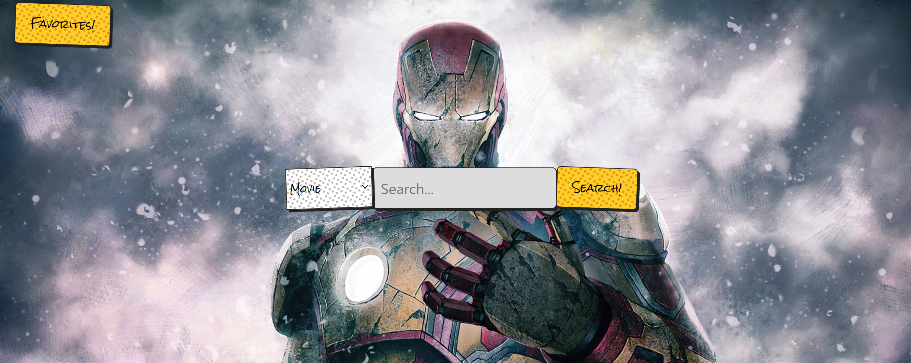
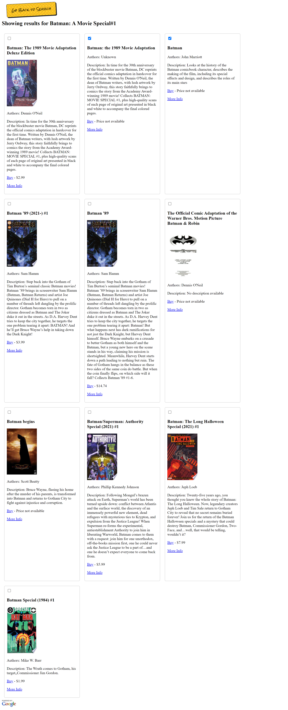
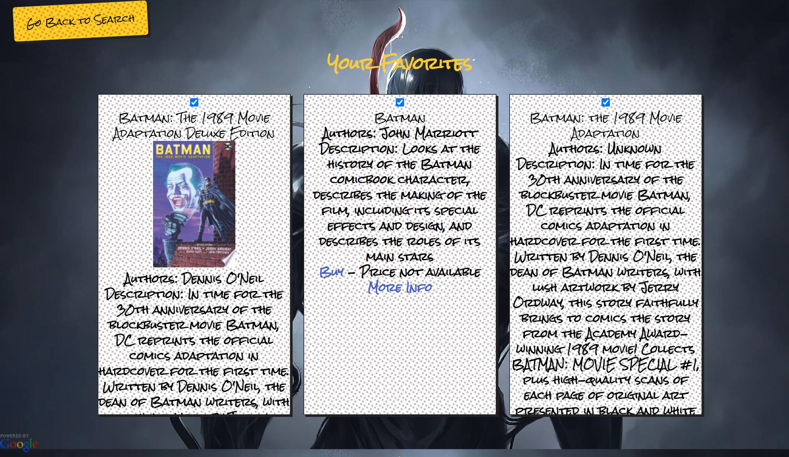

# The_Comic_Vault
**The Comic Vault**
A website that aims to bring together the exciting worlds of comic books, movies, and TV series. By leveraging the power of the Comicvine API and the Google Books API, The Comic Vault provides users with a unique platform to explore and discover related content in an effortless manner.

The Comic Vault utilizes the Comicvine API to match comic books, movies, and TV series, offering users an immersive experience that connects different mediums of storytelling.

**Search and Discover**
Users can easily search for a specific comic book, movie, or TV series and explore related content across different formats, allowing for an in-depth exploration of their favorite franchises.

**Google Books Integration**
By integrating the Google Books API, The Comic Vault provides users with the ability to discover and purchase available comic books or similar content directly from the Google Books platform.

**User-Friendly Interface**
 The Comic Vault boasts a user-friendly interface designed to enhance the browsing and discovery experience, providing users with a seamless and enjoyable journey through the interconnected worlds of comics, movies, and TV series.

**Target Audience**
The Comic Vault caters to comic book enthusiasts, movie buffs, and TV series fans who are passionate about exploring the connections and crossovers between different forms of media. Whether you're a devoted comic reader, a fan of comic book adaptations, or someone interested in discovering new stories, The Comic Vault offers a comprehensive platform to satisfy your cravings.

**Getting Started**
To get started with The Comic Vault, simply visit our website at [The Comic Vault](https://sienkc.github.io/The_Comic_Vault/index.html) Once there, you can begin exploring the vast universe of comic books, movies, and TV series. Our intuitive search functionality and well-organized categories will help you navigate through the content and discover exciting connections.

**Screenshots of Pages**

***License***
Licensed under [MIT](LICENSE)